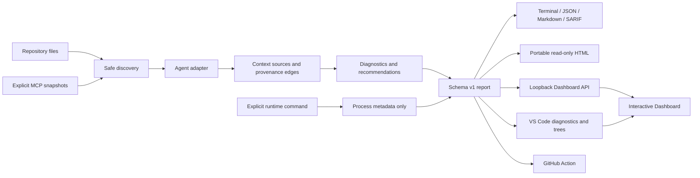

# Architecture

## Design principles

1. Local first: no hosted control plane is required.
2. Static by default: scanning never executes repository-provided commands.
3. One report, many surfaces: CLI, HTML, IDE, and CI consume schema v1.
4. Evidence over implication: observed, inferred, and unobservable are separate values.
5. Deterministic core: the same root, target, agent, task, and snapshot inputs produce stable source/finding identifiers.

## Data flow

## Packages

### `@context-ray/schema`

Owns serializable types, schema version, report validation, coverage vocabulary, and diff structure. It has no runtime dependencies.

### `@context-ray/core`

- `discover.ts`: bounded file discovery and agent adapters;
- `analyze.ts`: source, cross-source, cost, conflict, security, and quality rules;
- `diff.ts`: stable report comparison;
- `runtime.ts`: explicit child-process observation;
- `utils.ts`: path containment, token estimation, frontmatter, globs, hashes, relevance.

Content is retained only during analysis. Public reports contain excerpts rather than whole source files.

### `@context-ray/reporters`

Pure report transforms for terminal, JSON, Markdown, SARIF 2.1.0, report diff, and safe HTML injection. Script JSON escapes `<`, U+2028, and U+2029 before embedding.

### `context-ray` CLI

Coordinates argument validation, atomic output, baselines, severity exits, optional HTML opening, explicit runtime observation, and the loopback Dashboard server.

### `@context-ray/server`

Owns the local interactive session. It binds only to loopback, validates the request `Host`, keeps a bounded set of reports in memory, and exposes scan, scenario projection, source preview, and export endpoints. Target and preview paths are contained by the resolved repository root; it never executes repository code.

### Dashboard

React renders a single-file application. Visx supplies the token-composition SVG and Tabler supplies icons. `window.__CONTEXT_RAY_REPORT__` accepts a schema v1 report and `window.__CONTEXT_RAY_RUNTIME__` declares the available transport. There is no demo-report fallback: the app either displays an injected report or an explicit empty state. In server mode, scans, projections, previews, and exports use the loopback API; in VS Code mode they use a webview message bridge; portable HTML is read-only.

### VS Code extension

Runs core analysis in the extension host, publishes diagnostics, exposes sources/findings in Explorer, rescans supported files, and renders the same Dashboard in a webview. Webview requests are validated and routed to the extension host for real rescans, projections, repository-contained source previews, and save-dialog exports.

### GitHub Action

Bundles the complete analyzer and reporters into `packages/action/dist/index.cjs`, writes JSON/SARIF/Markdown, annotates findings, and applies a severity gate.

## Trust boundaries

- Repository root: all discovered real paths must remain inside it.
- Static/runtime: only `trace` crosses into command execution.
- Config/schema: an MCP declaration is not evidence that a server is live; a local snapshot is evidence only for its recorded schema.
- Repository/provider: private system prompts and provider transforms remain outside the model.
- Report/browser: source text is JSON-escaped and rendered as React text, not injected HTML.
- Browser/local API: the server accepts only loopback binds and loopback `Host` headers; source previews are limited to sources in a retained report.

## Compatibility

Schema v1 is backward compatible within the `0.x` development line by convention, but a future public `1.0` release should formalize JSON Schema compatibility tests and migration policy.
